id: apigee-keycloak-oidc-hackathon

# apigee-oidc-hackathon


## Welcome to the Apigee OIDC Hackathon!!!

### introduction
The main goal of this hackathon is to demonstrate - through some real examples - the security capabilities of Apigee (https://cloud.google.com/apigee) regarding **end-user Authentication for API access based on OIDC** (OpenID Connect)

### pre-requisites
In this hackathon, we will use the following solutions:
- [keycloak](https://www.keycloak.org/) as an Identity Provider (IdP): we will use a free docker image of keycloak
- [Google Cloud Platform](https://cloud.google.com/) - aka GCP -to leverage a kubernetes cluster, on which keycloak will be installed
- Apigee Edge for Public Cloud: you can subscribe for a trial account [here](https://login.apigee.com/sign__up)
- [Maven](https://maven.apache.org/) for the deployment of the Apigee technical artifacts on your target Apigee platform (SaaS)
- [openssl](https://www.openssl.org/) to be able to create cryptographic objects for TLS communications
- Any **HTTP client** like post(wo)man or cURL

### steps
Here are the different steps we will complete in the hackathon
- install keycloak on a Google Kubernetes Engine (GKE) cluster 
- configure a simple Client App and user in keycloak
- deploy an API Proxy on Apigee that is able to secure APIs - based on OIDC. All the material is provided on the repo

### Google code lab

#### Use [claat](https://github.com/googlecodelabs/tools) to generate static HTML site from the README.md Mardown document.
    $ go get github.com/googlecodelabs/tools/claat
    $ claat export ./README.md

This will create a **apigee-keycloak-oidc-hackathon** directory with static files. Serve it from any static file Web Server

<!-- ------------------------ -->

## Start keycloak installation

Duration: 20'

We are going to make it as simple as possible...do not forget that our goal is to understand OIDC concepts and security configuration in Apigee, not to spend our lives installing keycloak...

Let's consider that the installation of keycloak will not only be used for this hackathon. After the event, you will probably be interested in digging into the meanders of OAuth2.0 and OIDC in Apigee ;-)

This is why we are going to set a static IP address in GCP, that we can use on an ingress to access our keycloak platform

### Clone the git repo 

#### So at this step, please clone the git repo using https: 
    $ git clone https://github.com/JoelGauci/apigee-oidc-hackathon.git


All the commands must be executed at the root level of the newly created directory (**apigee-oidc-hackathon**)

### Create a Google Cloud Platform (GCP) project 

Connect to your GCP console

#### Create a project or use an existing one ... then from a terminal (and from the root of the cloned repo):
    $ gcloud components update
    $ gcloud init


### Create a Kubernetes cluster

#### We need a kubernetes cluster so let's create it!
    $ export CLUSTER_NAME=keycloak-cluster
    $ gcloud container clusters create $CLUSTER_NAME --num-nodes 3 --machine-type n1-standard-1

The ```keycloak-cluster``` is the cluster we use to provision the keycloak platform.

The creation process should last 2 to 3 minutes...during this time we can create a static IP address.

## Create a static IP address

For more details, you can refer to the GCP online documentation on **[how to reserve an external static IP address](https://cloud.google.com/compute/docs/ip-addresses/reserve-static-external-ip-address)**

#### Here is the command to create your static IP address:
    $ gcloud compute addresses create keycloak-ingress-lb \
        --global \
        --ip-version IPV4

**keycloak-ingress-lb** is the address's name of the IP for your ingress keycloak loadbalancer

#### To view the resulting IP address, use the following command:
    $ export ADDRESS_NAME=keycloak-ingress-lb
    $ echo $ADDRESS_NAME # for simple verification...
    $ gcloud compute addresses describe $ADDRESS_NAME

select **global** and note the static IP address that is returned (we call it {STATIC_IP_ADDRESS})

As we want a hostname to access the keycloak UI, we have the interesting option to use [xip.io](https://xip.io/): xip.io is a domain name that provides wildcard DNS
for any IP address. As an example, the host **a.b.c.d.xip.io** is resolved to **a.b.c.d**

We will use this type of hostname and our static IP address when configuring the ingress load balancer

## Export environment variables and set the GKE context

**GKE** means **Google Kubernetes Engine**

#### Export the keycloak hostname environment variable:
    $ export KEYCLOAK_HOST_NAME={STATIC_IP_ADDRESS}.xip.io
    $ echo $KEYCLOAK_HOST_NAME

...where **{STATIC_IP_ADDRESS}** is the value of your static IP address (example: ```10.11.12.13```)

At this time, please check that your kubernetes cluster has been created. 

#### Set the current context to your newly created cluster, where the name of the context is made up of "gke_" + project-id (your GCP project ID) + compute-zone + the name of the new cluster, separated with **underscores (_)**:

    $ kubectl config use-context gke_{project-id}_{compute-zone}_$CLUSTER_NAME


Here is an example: **gke_project1234_europe-west1-b_keycloak-cluster**


#### Check the current context to be sure it is set to the intended cluster:
    $ kubectl config current-context


Now that your cluster has been created and your gcloud context has been set, you can deploy keycloak on the target cluster!

## Deploy keycloak on your Kubernetes cluster and make it accessible

### Here is the command to deploy keyclok on yoyur kubernetes cluster
    kubectl create -f ./k8s/keycloak.yaml

This will start Keycloak on Kuberneters. It will also create an initial **admin** user with username ```admin``` and password... ```admin``` ;-)

#### Let's create crypto objects for the ingress (private key and self-signed certificate) that we can use to access the keycloak UI. For this we use the "*.xip.io" common name (CN):


    $ openssl req -x509 -out tls.cert -keyout tls.key -newkey rsa:2048 -nodes -sha256 -subj '/CN=*.xip.io' -extensions EXT -config <( printf "[dn]\nCN=*.xip.io\n[req]\ndistinguished_name=dn\n[EXT]\nbasicConstraints=critical,CA:TRUE,pathlen:1\nsubjectAltName=DNS:*.xip.io\nkeyUsage=digitalSignature,keyCertSign\nextendedKeyUsage=serverAuth")

#### Create the kubernetes secret for the ingress:
    $ kubectl create secret tls tls-secret --cert=tls.cert --key=tls.key


#### Create the ingress that will be the entry point to access the keycloack UI (```ingress.yaml``` is provided in the repo):
    $ template=`cat ./k8s/ingress.yaml`
    $ set -e
      eval "cat <<EOF
      $template
      EOF
      " | kubectl create -f -
 
#### Verify that the ingress has been created:

    $ kubectl get ingress

...the ADDRESS field should be provisioned in less than 5 minutes


## Access the keycloak User Interface (UI)

#### From there you can access your keycloak UI using the following URL in your favorite Web brower (Chrome!): 

    echo "https://$KEYCLOAK_HOST_NAME"

Accept the connection even if you see a **ERR_CERT_AUTHORITY_INVALID** error on your Web browser (remember the cert is self-signed!)

Now you should see the keycloak admin console!!! **Well done!**

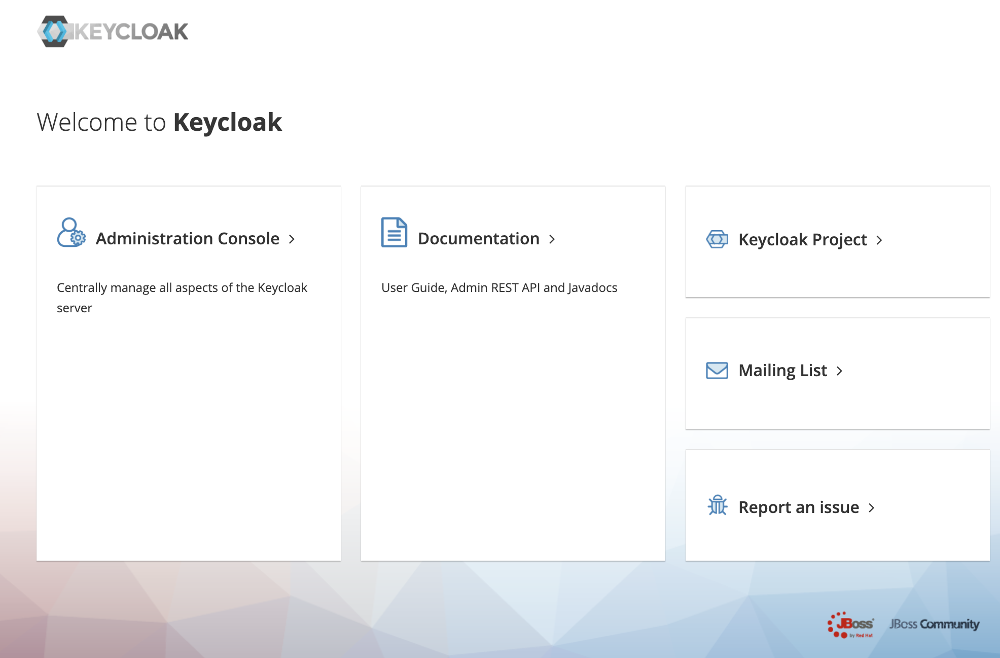

**The hackathon goes on with some basic keycloak configuration steps and a test**

## basic keycloak configuration

In the following steps we will configure keycloak as an IdP (identity provider)

The 3 main steps of the configuration are:
- create a dedicated keycloak **realm** for the purpose of the test
- create a **client app**
- create an **end user**

I will not provide configuration details (still remember what is our goal?) but all screenshots provide the information you need to execute what needs to be done

Just login to your keycloak admin console using the **admin** account (login: **admin** - password: **admin**)

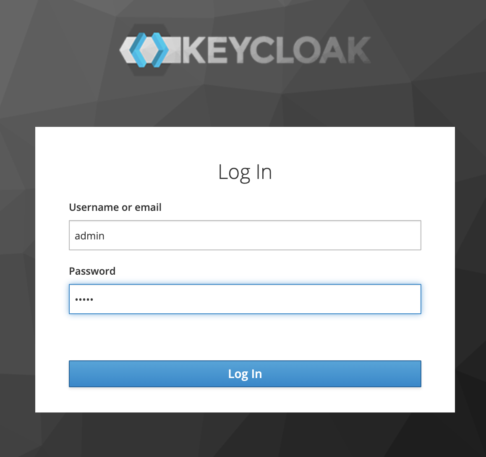

### create a demo realm

Add a realm, name it **demo**:

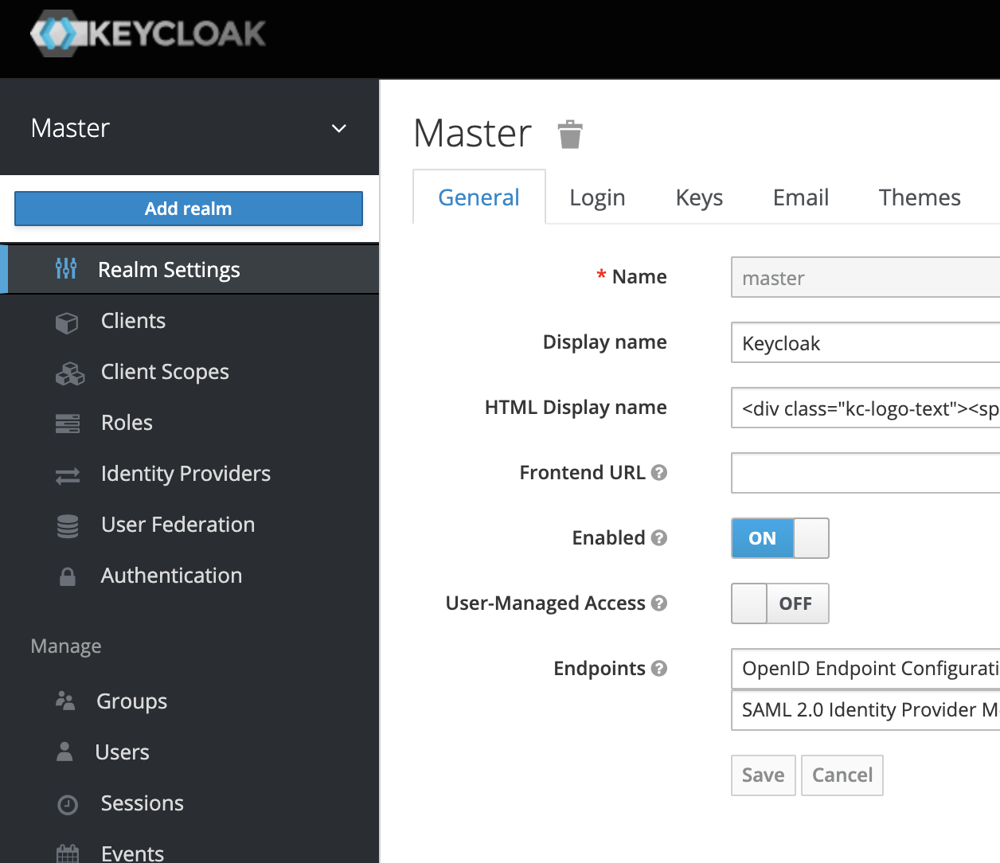

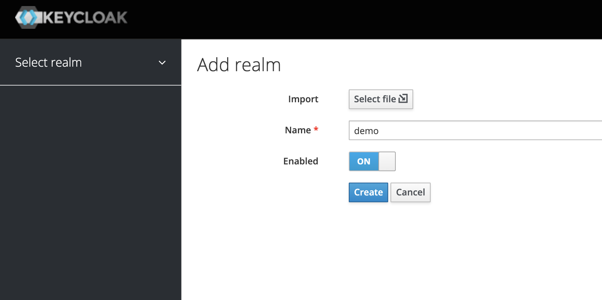

You can access the **demo** realm settings:

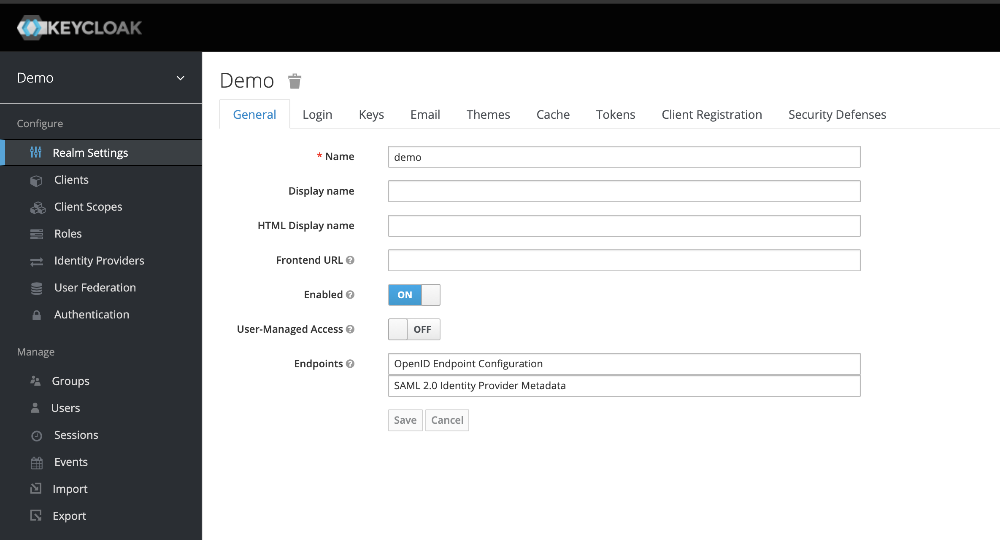

### create a client app

Access the **Clients** configuration panel:

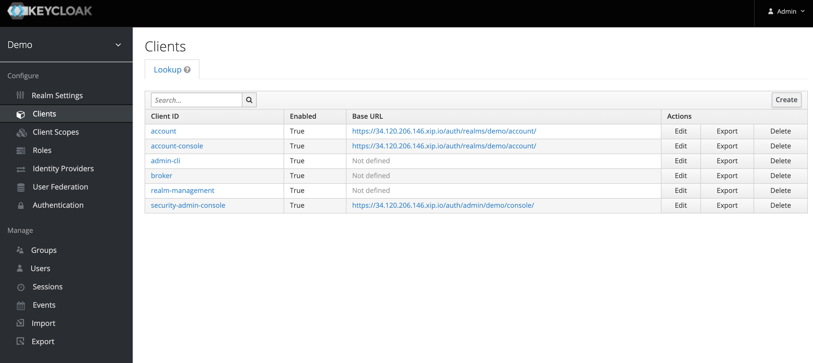

Create a new client app (**my-client-app**)

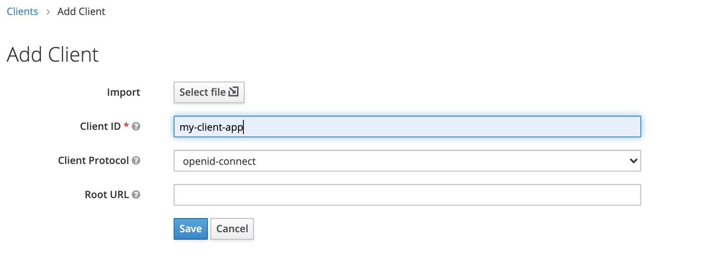

Modify/configure properties as defined in the following picture:

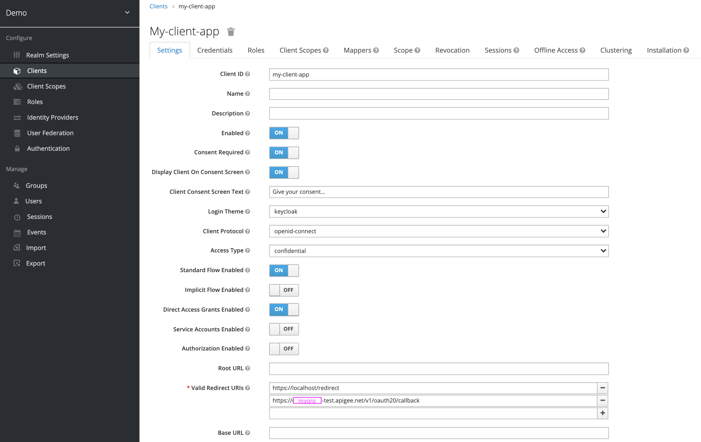

> Important: **Access Type** set to **confidential**, **Consent Required** set to **on**, **Valid Redirect URIs** set with 2 values:  **https://httpbin.org/get** and **https://{myorg}-test.apigee.net/v1/oauth20/callback** ...where {myorg} is the name of your Apigee organization

Keep default values for client scopes:

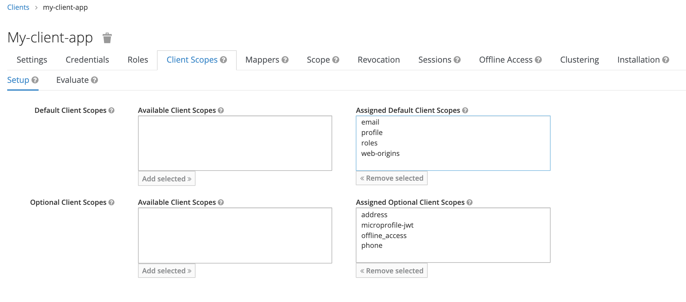

### create an end user

We finalize the keycloak configuration creating an end user

Access the **Users** configuration panel and add a user (there is a button for that;-):

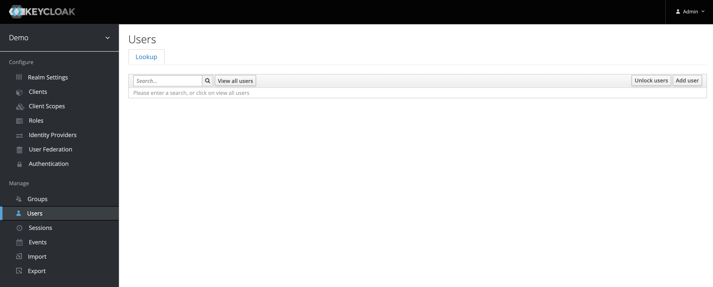

Define **username**, **email** and **required user actions**:

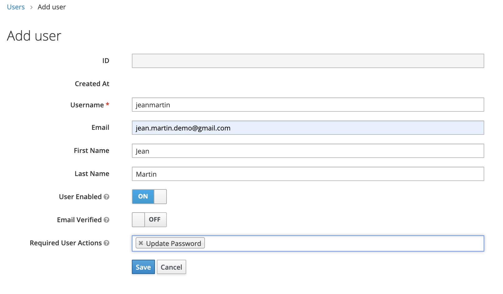

Please use values of your convenience...

From the **Credentials** tab, set the user's password: 

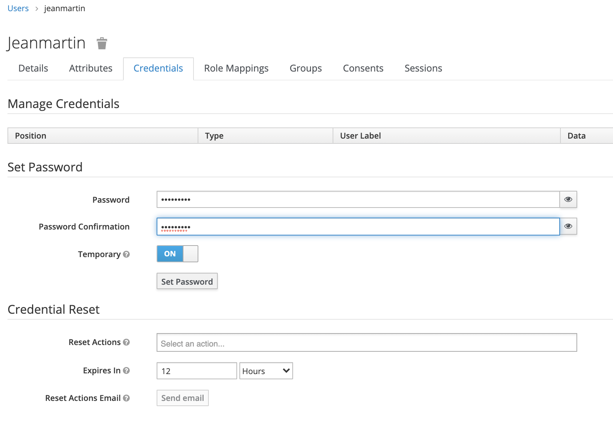

Confirm that you want to set password for the user:

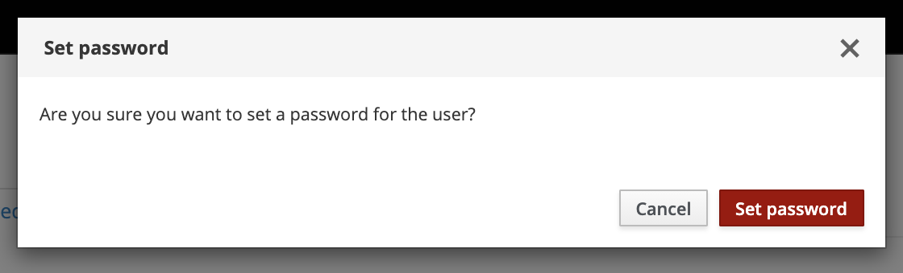

Later, you will be able to check user's consent from the **Consents** tab:

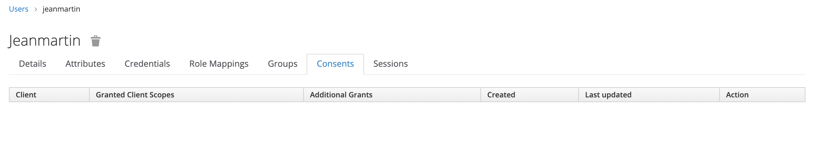

## Set App User credentials into environment variables 

#### A this step, please set the 2 following environment variables, related to the user you have just created:
    export KEYCLOAK_USER_USERNAME={username}
    export KEYCLOAK_USER_PASSWORD={password}

...where **{username}** is the name of the user and {password} is the user's password

The basic configuration we want to implement is over! Let's test it quickly!

## keycloak configuration testing
 
For this, we need endpoints information regarding our keycloak IdP...

#### You can access the **list of exposed endpoints** (+some other info) using the following URL:
    echo "https://$KEYCLOAK_HOST_NAME/auth/realms/demo/.well-known/openid-configuration"

#### If you invoke this URL using a REST client (like [hoppscotch.io](https://hoppscotch.io/)), you should see a response like this one (I just provide an extract of the JSON response):

    {
      "issuer": "https://a.b.c.d.xip.io/auth/realms/demo",
      "authorization_endpoint": "https://a.b.c.d.xip.io/auth/realms/demo/protocol/openid-connect/auth",
      "token_endpoint": "https://a.b.c.d.xip.io/auth/realms/demo/protocol/openid-connect/token",
      "introspection_endpoint": "https://a.b.c.d.xip.io/auth/realms/demo/protocol/openid-connect/token/introspect",
      "userinfo_endpoint": "https://a.b.c.d.xip.io/auth/realms/demo/protocol/openid-connect/userinfo",
      "end_session_endpoint": "https://a.b.c.d.xip.io/auth/realms/demo/protocol/openid-connect/logout",
      "jwks_uri": "https://a.b.c.d.xip.io/auth/realms/demo/protocol/openid-connect/certs",
      "check_session_iframe": "https://a.b.c.d.xip.io/auth/realms/demo/protocol/openid-connect/login-status-iframe.html",
      "grant_types_supported": [
        "authorization_code",
        "implicit",
        "refresh_token",
        "password",
        "client_credentials"
      ],
      "response_types_supported": [
        "code",
        "none",
        "id_token",
        "token",
        "id_token token",
        "code id_token",
        "code token",
        "code id_token token"
      ],
      ...


... where ```a.b.c.d.xip.io``` is your valid keycloak hostname!

#### In order to quickly test your configuration, execute the following authorization URL into your Chrome Web browser:
    echo "https://$KEYCLOAK_HOST_NAME/auth/realms/demo/protocol/openid-connect/auth?client_id=my-client-app&response_type=code&state=blablabla&redirect_uri=https://httpbin.org/get"


> Important: **client_id**, **response_type** and **redirect_uri** are required query parameters. It is also a best practice to provide a **state** parameter

You will be redirected to the login page of keycloak demo realm:

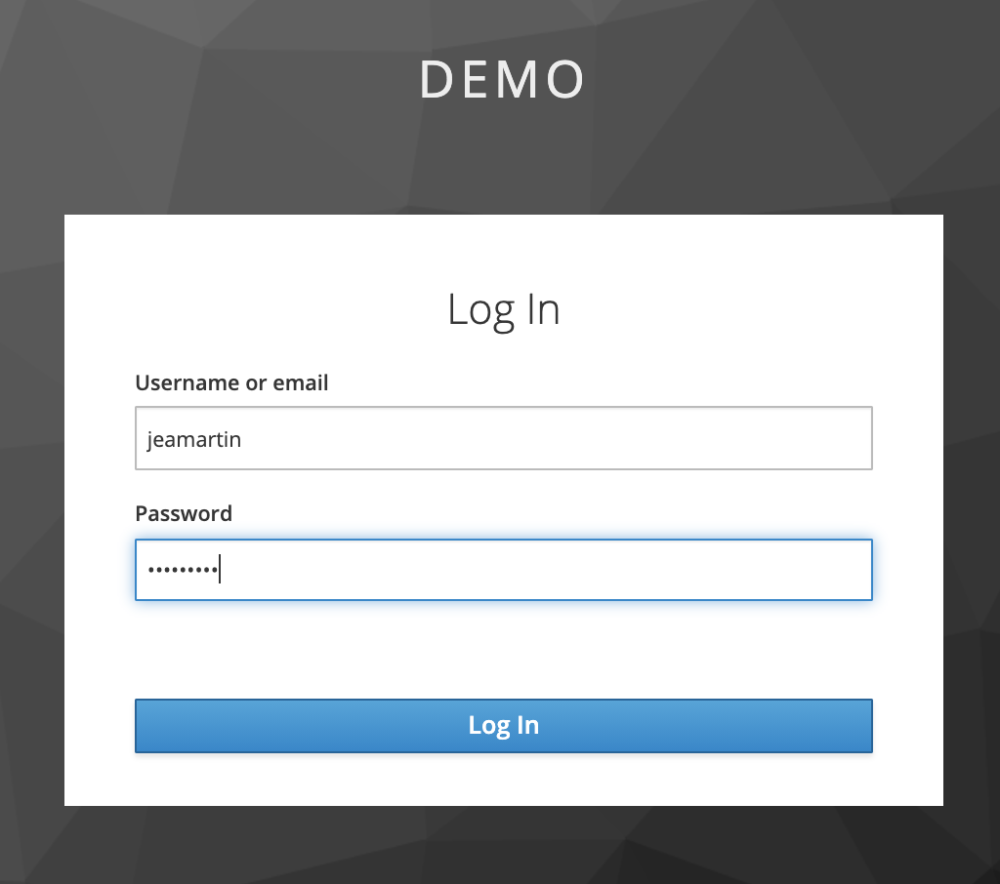

Use the end user's login and password (my user is *jeanmartin*)
Once authenticated, you may have to modify the user's password - as it is your first connection:

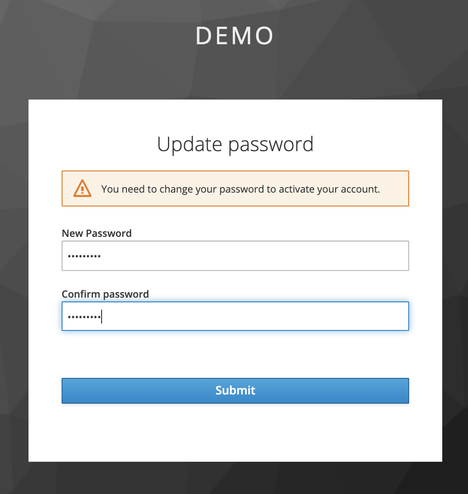

Once authenticated, you reach the consent page (default one w/ keycloak logo):

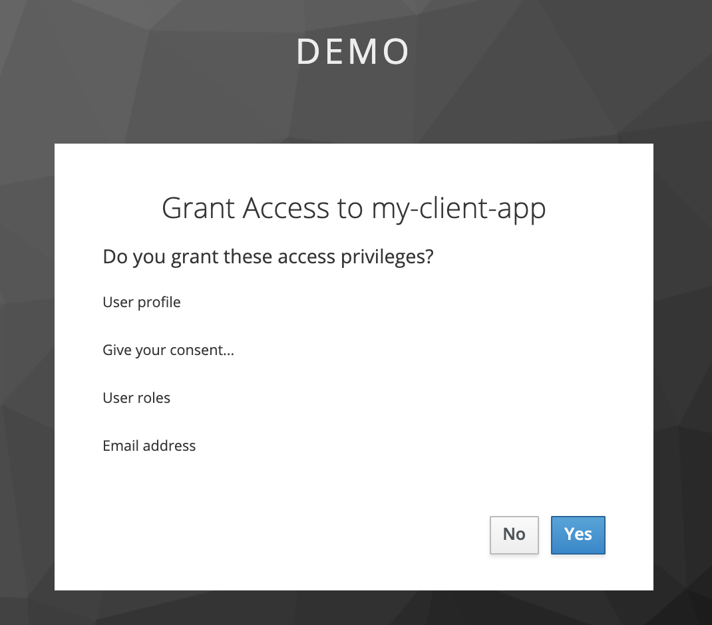

As an authenticated user you can (or not) give the client app (**my-client-app**) access to some of your protected user information: user profile, email address, user roles... so make the right choice !

If you give your consent you are redirected (```HTTP 302```) to the valid client app redirect URI: ```https://httpbin.org/get```

Look at the query parameters provided on this redirection URL... you should see an **authorization code** (```code=xxx```). 

#### This code would be used by the client app to access a valid JWT token that would contain an OAuth2.0 access token:
    https://httpbin.org/get?state=blablabla&session_state=2a7f170b-c3db-4e10-858b-2a2559eaf060&code=8b773b67-df66-4cd0-a271-4dcf53b723d8.2a7f170b-214 

On the next step we are going to set client secret (of **my-client-app**) into an environment variable!

## Set App Client Secret into an environment variable

The very last step, before deploying Apigee artifacts is to store the client secret of ```my-client-app``` into a dedicated environment variable:

Please go back to the **Clients** section of your keycloak UI and select your client (```my-client-app```)

Click the **Credentials** tab and copy the value of my-client-app's client secret:

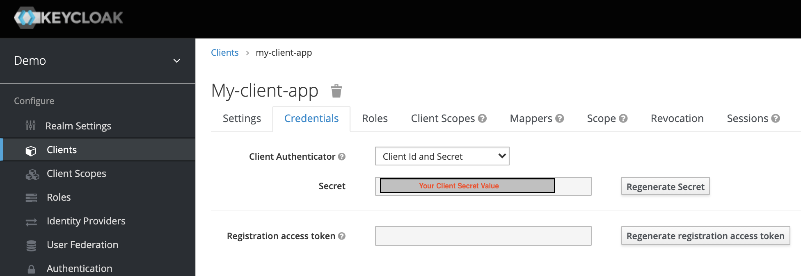

#### In your terminal, create the **APP_CLIENT_SECRET** env variable:
    $ export APP_CLIENT_SECRET={THE_VALUE_OF_YOUR_CLIENT_SECRET}

...where **{THE_VALUE_OF_YOUR_CLIENT_SECRET}** is the real value of the client secret  (example: ```85eddedb-0214-4c7c-0911-1129afc9e85f```)

Your basic keycloak configuration is now in place!!! **Well done!**


## Apigee Deployment

Duration: 20'

Please clone the github repo of the identity hackathon if not done yet. You should be able to get all the Apigee material we will use during the hackthon

First we are going to check that all the required env variables have been defined. Indeed, we use maven to deploy config and proxy on Apigee Edge for Public Cloud and for this we need credentials...that can be set as env variables! + we want to check that keycloak hostname and app secret have been set also !

Here are the 5 env variables that MUST be set in order to execute a successfull deployment on Apigee:
- **APIGEE_ORG**: the name of the target Apigee organization (org) you are using for this hackathon
- **APIGEE_USER**: the Apigee username of the account used to connect to the Apigee Management API. Typically, this user has an ```orgadmin``` role in Apigee. If you are using an Apigee trial account, this is the username you use to connect to your Apigee org
- **APIGEE_PASSWORD**: the Apigee password of the account used to connect to the Apigee Management API. Typically, this user has an ```orgadmin``` role in Apigee. If you are using an Apigee trial account, this is the password you use to connect to your Apigee org
- **KEYCLOAK_HOST_NAME**: the hostname used to access your keycloack platform (example: ```10.11.12.13.xip.io```)
- **APP_CLIENT_SECRET**: the client secret of the application created in keycloak

## Check environment variables

#### In your terminal, at the root level of the **apigee-oidc-hackathon** directory, execute the follwing script:
    $ ./check_envvar.sh

#### The response should be similar to the following one:
    APIGEE_ORG is set!
    APIGEE_USER is set!
    APIGEE_PASSWORD is set!
    KEYCLOAK_HOST_NAME is set!
    APP_CLIENT_SECRET is set!
    KEYCLOAK_USER_USERNAME is set!
    KEYCLOAK_USER_PASSWORD is set!


In case of a problem with one or several env variables, it is time to fix it!

You are now ready to deploy the Apigee technical artifacts for he hackathon. 

## Deploy Apigee technical artifacts

Here are the elements that will be uploaded on your Apigee organization:

- **apigee-oidc-v1**: API Proxy
- **IdentityProduct**: API Product
- **identityApp**: application
- **helene.dozi.demo@gmail.com**: App developer
- **IDP_JWKS_CACHE**: environment (*test*) cache
- **idpConfig**: environment (*test*) KVM (Key Value Map)

The KVM contains all the parameters required to connect the keycloak IdP

#### Let's deploy these 6 elements:
    $ ./pipeline.sh

You can follow the deployment process: ```set -x``` (in the ```pipeline.sh``` script) enables a mode of the shell where all executed commands are printed to the terminal

#### At the end of the build process, you should see a response/status like this one:
    [INFO] Update Success.
    [INFO] ---------
    [INFO] BUILD SUCCESS
    [INFO] ---------
    [INFO] Total time: 22.539 s
    [INFO] Finished at: 2020-09-14T18:06:16+02:00
    [INFO] ---------


Take some time to connect to your Apigee organization and have a look on the different objects, which have been created.

## Apigee used as an identity proxy

OIDC allows an application to use an authority to:
- Verify end user’s identity (Signed JWT - id_token)
- Fetch end user’s profile info (UserInfo Endpoint)
- Gain limited access to end user’s data (Access token)

The Identity Provider is the server offering the authentication service. 

It combines the roles of OAuth Authorization Server & Resource Server, the resource being the End-User’s identity.

It is made of 4 Endpoints (HTTP resources) : 
 - Authorization Endpoint, 
 - Token Endpoint, 
 - UserInfo Endpoint, 
 - Redirect Endpoint.

It distributes OAuth tokens as well as an ID Token in JWT format.

In the hackathon, we use the **authorization code flow**

#### The URL used to initiate the authorization code flow is of the form:
    GET /authorize?
      response_type=code
      &scope=openid%20profile%20email%20address%20phone
      &client_id=s6BhdRkqt3
      &state=af0ifjsldkj
      &redirect_uri=https%3A%2F%2Fclient.example.org%2Fcb 
    HTTP/1.1
    Host: server.example.com


#### The response of the authorization code flow is a redirection to the client app's callback/redirect URL, as presented here:
    HTTP/1.1 302 Found
    Location: https://client.example.org/cb
      ?code=SplxlOBeZQQYbYS6WxSbIA
      &state=af0ifjsldkj

The client app uses the authorization code to get a valid access token or ID Token

When Apigee plays the role of an **identity proxy** in front of an IdP (like keycloak), here is a solution presented as a sequence diagram:

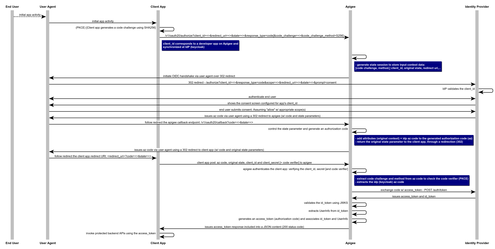

In this solution, a client app consumes an API using an access token. Apigee verifies the access token and extract the JWT token that hes been previously set as an attribute of the access token, during the OIDC/OAuth "*dance*":

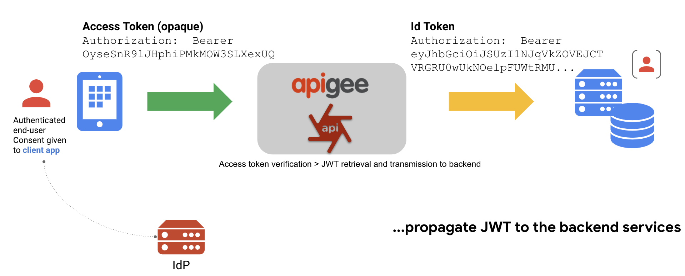

## Deep dive into the API Proxy...

At this step, we are going to connect to the **apigee-oidc-v1** API Proxy and activate the trace:

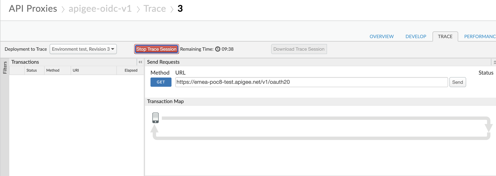

#### Open your favorite Web browser and execute the following URL:
    https://$APIGEE_ORG-test.apigee.net/v1/oauth20/authorize?
      client_id=my-client-app
      &response_type=code
      &state=1234567890-ABCD
      &redirect_uri=https://httpbin.org/get


You will be redirected to your keycloak authentication page:

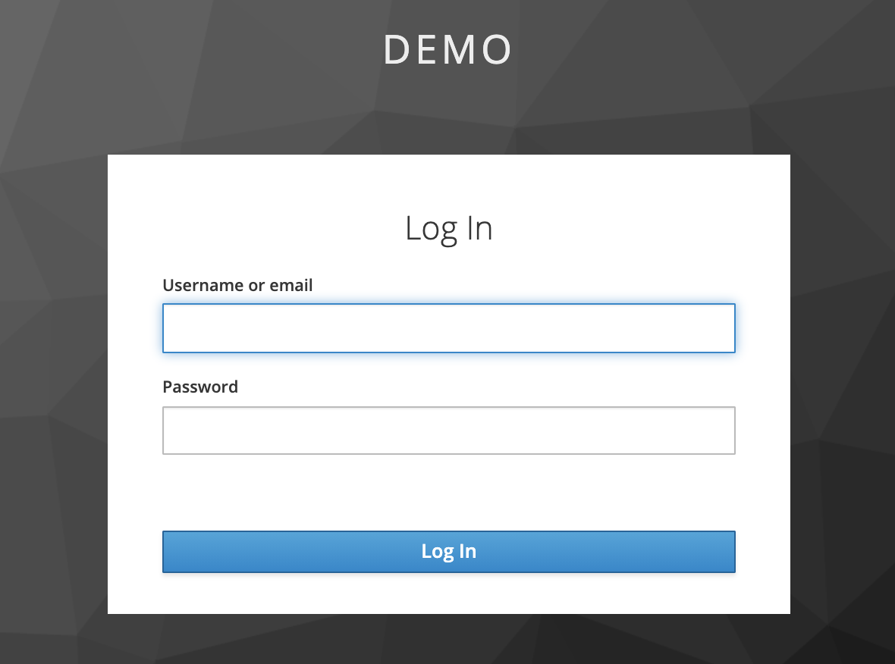

Enter **jeanmartin**'s login and password that you have set when creating this user

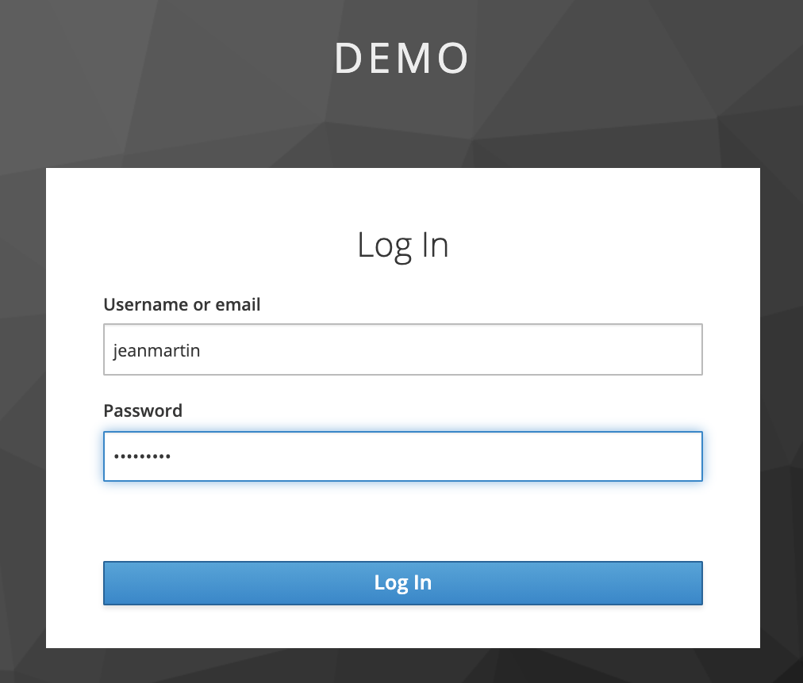

You now access the consent page. The question here is simple: you have just been authenticated but do you give your consent in order for ```my-client-app`` (client application) to access your personal data (email addres, address, phone number...)?

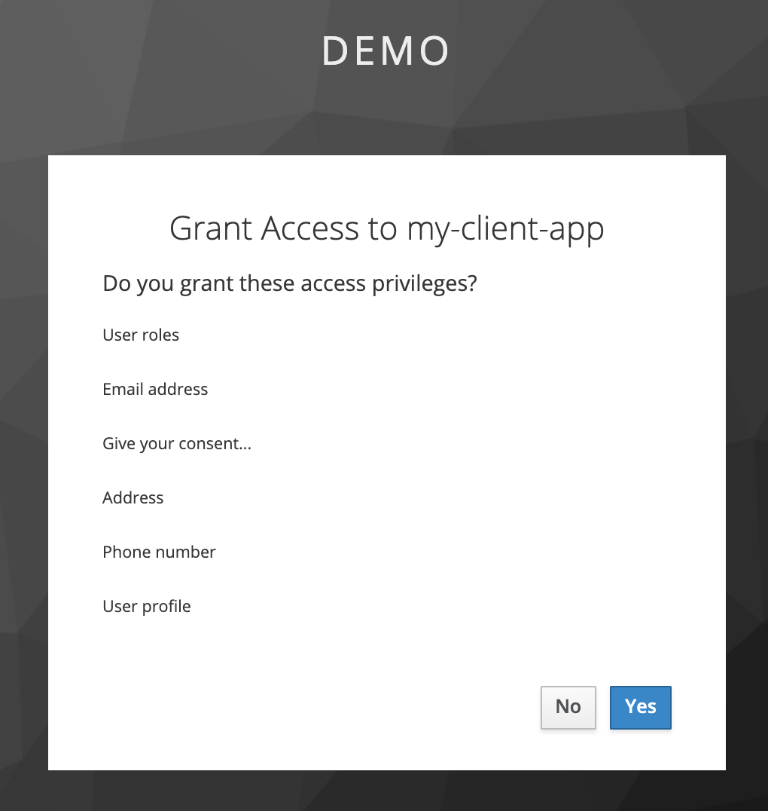

#### Once you have clicked yes you can see (in the web browser) that you have been redirected to an URL of the form:
    https://httpbin.org/get
      ?code=gj6I3rDP
      &state=1234567890-ABCD


The redirection to the client app has been executed and an authorization code + state parameter have been pushed to the app (the redirect url intentionally uses ```localhost```)

Please copy the value of the authorization code and uses an HTTP client (cURL, postman, postwoman/hoppscotch,...) in order to POST data that will allow you retrieving a valid access token and refresh token:

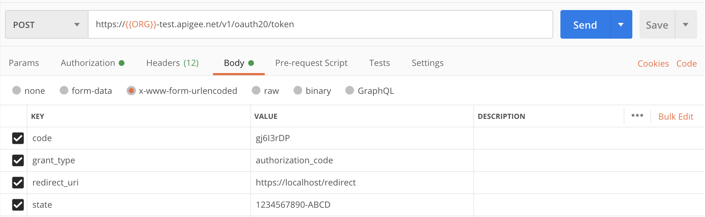

> If you use post(wo)man, do not forget to set a **basic authorization** header with the value ```my-client-app``` set as username and value of ```$APP_CLIENT_SECRET``` set as password

#### Here is the cURL command to use:
    $ curl -k1 -X POST https://$APIGEE_ORG-test.apigee.net/v1/oauth20/token \
    -H 'Content-Type: application/x-www-form-urlencoded' \
    -H 'Accept: application/json' \
    -u my-client-app:$APP_CLIENT_SECRET \
    --data-urlencode 'code=am08dFT4' \
    --data-urlencode 'grant_type=authorization_code' \
    --data-urlencode 'redirect_uri=https://httpbin.org/get' \
    --data-urlencode 'state=1234567890-ABCD' \
    -v


#### The response is based on a JSON content type. Here is an extract showing the type of value you should get as a response:
    {
      ...
      "access_token": "AGwNYtp04irLlWERipYOFvVKv3bF",
      "refresh_token": "m3qnGAdq9NB3fnKFwSM4TVQ1HMXLHsZH",
      "subject.email": "jean.martin.demo@gmail.com",
      "subject.family_name": "Martin",
      "status": "approved",
      "expires_in": ...
    }


The following Apigee traces depict what's happening on the Apigee side when the process you have just executed is performed:

First, the intial request is received by Apigee through an ```authorization``` endpoint. Apigee acts as an identity proxy:

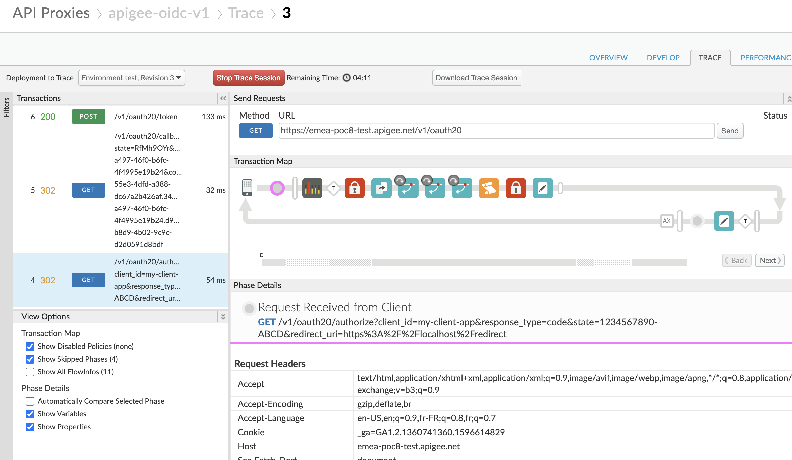

The result of this flow is a redirection to the keycloak IdP - cf. the **Location** parameter:

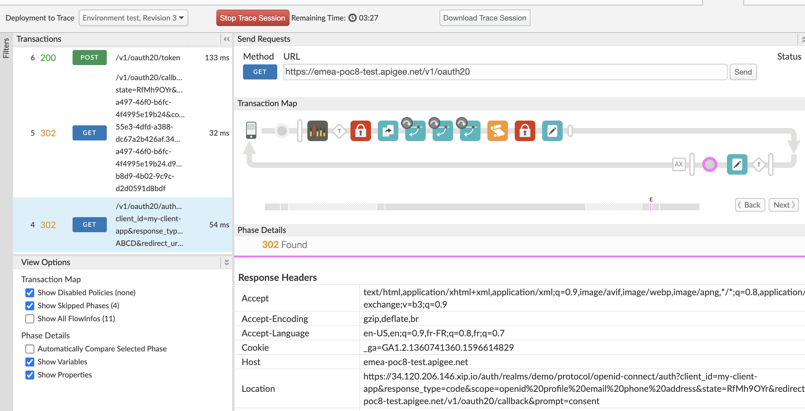

The keycloak IdP then redirects its authorization code and own state to the Apigee ```callback``` URL (after authentication and consent of the user):


After verifications and controls a redirection is done to the client app redirection URI. Now Apigee hiddes keycloak parameters, produces its own authorization code and uses the initial state parameter (pushed by the client app):

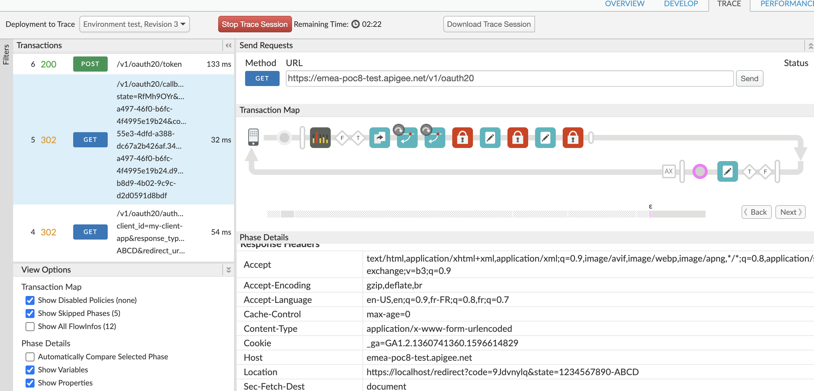

The client app uses the Apigee authorization code to get an access token, using the Apigee dedicated ```token``` endpoint (cf. the form parameters in the request body):

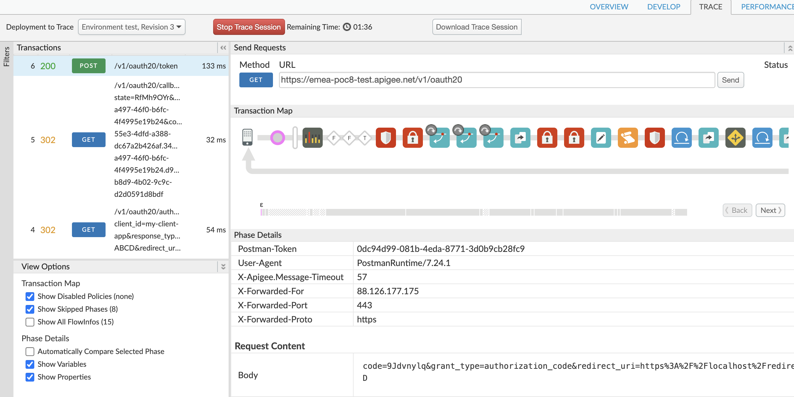

Apigee connects to the keycloak IdP (using a ```ServiceCallout``` policy) to get a valid JWT token, as presented here:


If you copy the ID token from the trace and paste it into [jwt.io](https://jwt.io/), you can see the token info decoded. 

Here is an example:

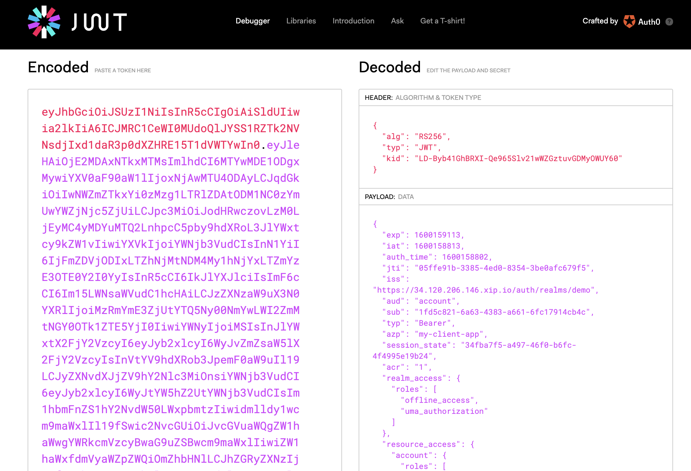

User info can also be decoded from the token:

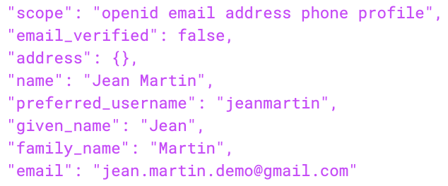

Finally, the Apigee token endpoint response can be seen in the trace. It consists of a valid JSON message that includes: access token, refresh token, token expiry,...The ID token is not presented to the client app but has been set as an attrtibute of the access token.

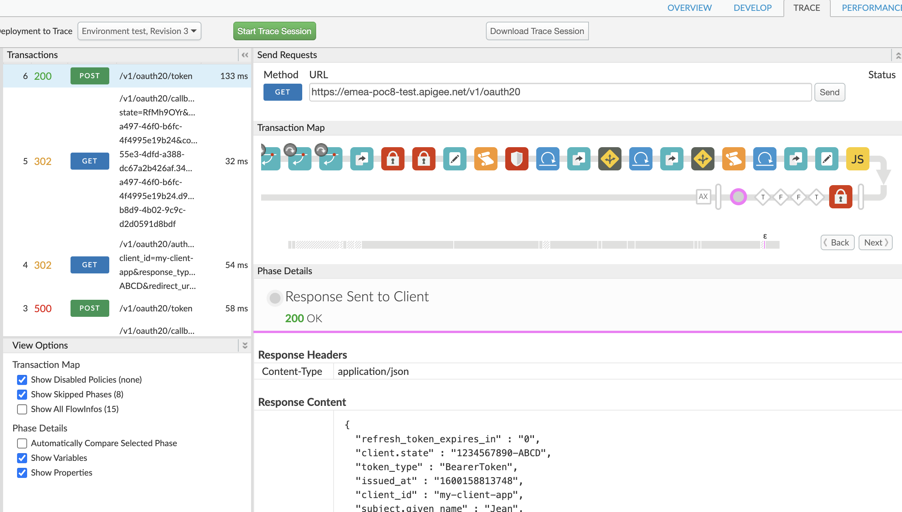

Each time the access token will be checked on the identity proxy (Apigee) it will be possible to get the ID token attribute and inject it (or part of its info) to the backend resources

Take time to investigate the different endpoints exposed by the ```apigee-oidc-v1``` proxy but also the technical artifacts deployed on your Apigee organization.

You have reached the end of the identity hackathon!!! **Well done!**
